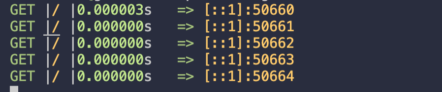

# Requel

http logging middleware for the [gorilla](https://github.com/gorilla/mux) framework


### Install 
` go get -u github.com/s1ntaxe770r/requel `

Example 

```go 

package main

import (
	"net/http"

	"github.com/gorilla/mux"
	"github.com/s1ntaxe770r/requel"
)

func main() {
	router := mux.NewRouter()
	router.Use(requel.LogReq)
	router.HandleFunc("/", func(w http.ResponseWriter, r *http.Request) {
		w.Write([]byte("consider leaving a star"))
	})

	http.ListenAndServe(":5050", router)

}

```
Sample output




The request method, path ,execution time and ip  are logged 

### Todos 
- [ ] log http response 
